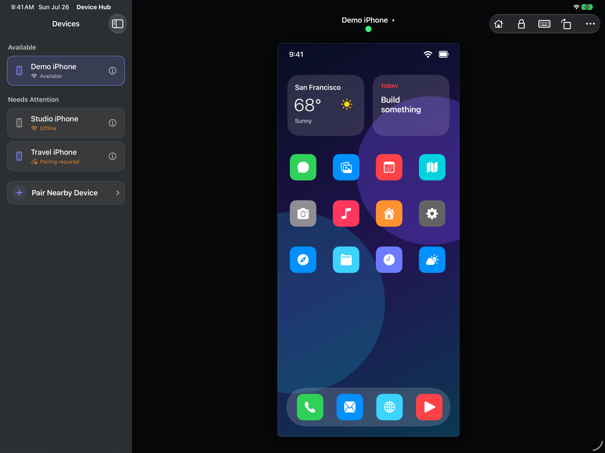

# Device Hub iOS



[](https://github.com/JaviSoto/device-hub-ios/actions/workflows/ci.yml)


[](LICENSE)

This repository contains a port of Apple's new
[Device Hub](https://developer.apple.com/documentation/xcode/managing-your-simulated-and-physical-devices-in-device-hub)
app included with Xcode 27, built to run on iOS and iPadOS.

Device Hub pairs with a compatible Apple device, displays its screen, and
controls it from another iPhone or iPad. The implementation builds on the
open-source [`idevice`](https://github.com/jkcoxson/idevice) protocol stack and
uses private, undocumented Apple interfaces.

## Features

- Discover, pair, and reconnect to compatible devices on the local network.
- View a clean initial screenshot followed by a live HEVC display stream.
- Send taps, drags, and keyboard input.
- Use Home, Lock, Rotate, Siri, mute, and volume controls.
- Preserve controller identity and pairing records securely in Keychain.
- Adapt the remote experience across iPhone, iPad, portrait, landscape, and
  narrow iPad windows.

## Requirements

- macOS with Xcode 27 and the iOS 27 SDK
- An iPhone or iPad running iOS or iPadOS 27
- A compatible target device with Developer Mode enabled
- An Apple development signing identity for device installation
- Local-network connectivity between the controller and target

Device Hub iOS is currently verified against the Beta 3 train of iOS 27 and
iPadOS 27. Later seeds may require protocol updates.

## Getting started

The Xcode project is generated with
[XcodeGen](https://github.com/yonaskolb/XcodeGen). Development tools and common
workflows are managed by [mise](https://mise.jdx.dev/).

```sh
git clone https://github.com/JaviSoto/device-hub-ios.git
cd device-hub-ios
mise trust
mise install
mise run setup
mise run build
```

The default build is unsigned. For a signed device build, copy
`Config/Local.xcconfig.example` to `Config/Local.xcconfig`, then set
`DEVICE_HUB_BUNDLE_IDENTIFIER` and `DEVICE_HUB_DEVELOPMENT_TEAM` for your
Apple Developer account. `Local.xcconfig` is gitignored;
`Config/Project.xcconfig` contains the portable project defaults.

Available tasks:

| Task | Purpose |
| --- | --- |
| `mise run setup` | Prepare dependencies and generated build inputs |
| `mise run generate` | Regenerate the Xcode project |
| `mise run build` | Build the app for development |
| `mise run test` | Run the test suites |
| `mise run lint` | Run formatting, lint, and static-analysis checks |
| `mise run previews` | Render the visual review matrix |
| `mise run snapshots:record` | Regenerate and verify iOS visual snapshots |
| `mise run archive` | Create an app archive with local signing settings |
| `mise run ci` | Run the appropriate local verification suite for the current changes |

Run `mise tasks` for the full task list.

## Project structure

```text
DeviceHubApp
└── DeviceHubUI                    SwiftUI remote experience
    └── DeviceHubFeature           State, actions, and effects
        ├── DeviceHubCore          Pure domain values and transforms
        ├── DeviceHubDiagnostics   Typed, redacted diagnostics
        └── DeviceHubClient        Product-facing client contract
            └── DeviceHubTransport Swift/Rust session boundary
                ├── Keychain persistence
                ├── HEVC media pipeline
                └── DeviceHubFFI.xcframework
                    └── pinned idevice source and patches
```

Swift owns the app lifecycle, interface, Bonjour discovery, endpoint
validation, Keychain persistence, feature state, and decoded-frame delivery.
Rust owns pairing, authenticated tunnels, Remote Service Discovery, CoreDevice
services, display transport, and HID input.

More documentation:

- [Architecture](Docs/Architecture.md)
- [Product](Docs/Product.md)
- [Protocol and security](Docs/ProtocolSecurity.md)
- [Design system](Docs/Design.md)
- [Testing](Docs/Testing.md)
- [Contributing](CONTRIBUTING.md)

## Built on

- [`jkcoxson/idevice`](https://github.com/jkcoxson/idevice) provides the Rust
  protocol foundation for pairing, CoreDevice tunnels, display, and HID.
- [The Composable Architecture](https://github.com/pointfreeco/swift-composable-architecture)
  provides explicit feature state, actions, effects, and cancellation.
- [Swift Dependencies](https://github.com/pointfreeco/swift-dependencies)
  provides controlled live and test dependencies.
- [SnapshotTesting](https://github.com/pointfreeco/swift-snapshot-testing),
  [Custom Dump](https://github.com/pointfreeco/swift-custom-dump), and
  [Issue Reporting](https://github.com/pointfreeco/xctest-dynamic-overlay)
  support deterministic testing and diagnostics.

Exact dependency revisions and notices are recorded in
[Swift package licenses](Licenses/Swift.md) and the
[`idevice` MIT notice](Licenses/idevice-MIT.txt).

## Future directions

- Multiple simultaneous remote sessions in separate iPadOS windows
- Explicit clipboard and file transfer

## Contributing and security

Contributions are welcome. Start with [CONTRIBUTING.md](CONTRIBUTING.md) for
the project architecture and development workflow.

Please report security issues privately as described in
[SECURITY.md](SECURITY.md). Do not include pairing material, device
identifiers, network addresses, screenshots, screen contents, or raw protocol
traffic in public issues.

## Legal and responsible use

Device Hub is an unofficial project and is not affiliated with, endorsed by,
sponsored by, or distributed by Apple Inc. Apple, Xcode, macOS, iOS, iPadOS,
iPhone, and iPad are trademarks of Apple Inc.

Use Device Hub only with devices you own or are explicitly authorized to
control. Private and undocumented interfaces are unsupported and may change
without notice. You are responsible for complying with applicable laws,
platform terms, signing requirements, and device-management policies.

## License

Device Hub is available under the [MIT License](LICENSE). Third-party
components remain subject to their own licenses and notices.

## Credits

Device Hub was built by **Codex**, powered by **GPT-5.6 Sol**, under
[Javier Soto](https://github.com/JaviSoto)'s direction.
